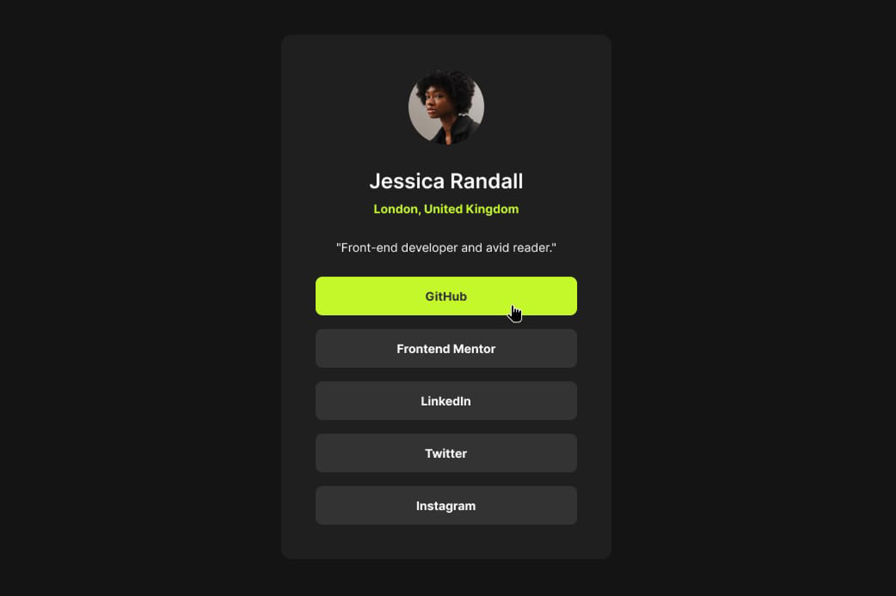

# 🌟 Fully Responsive Social Links Profile\*\*

  

🔗 **Live Demo:** ([View the Project](https://chrisbk9674.github.io/social-links-profile/) )

This project is a **Social Links Profile** built as part of a **Frontend Mentor coding challenge**. The goal was to replicate a provided design **as accurately as possible** using **HTML, CSS and Javascript**, ensuring a polished and functional UI.

## ✨ Features

- ✅ **Interactive, pixel-perfect design** based on a provided flat image.
- ✅ **Fully responsive** for both desktop and mobile screens.
- ✅ **Hover & focus states** for interactive elements.
- ✅ **Clean, semantic HTML & modular CSS** for maintainability.

## 🛠 Tech Stack

  

